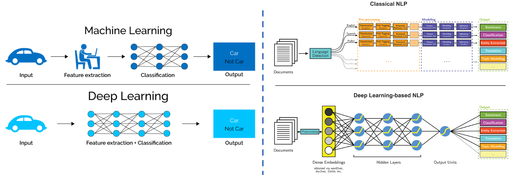

# Module 09: Overview of Natural Language Processing

### Overview of NLP:
- Overview of NLP, Challenges of NLP (Language Ambiguities), Real World Applications of NLP, Approaches used to solve NLP use cases, Heuristic Method Approach, Machine Learning Approach, Deep Learning Based Approach, NLP Pipeline.

### Pre-Processing:
- Removing digits and words containing digits, Removing newline characters and extra spaces, Removing HTML tags, Removing URLs, Removing punctuations.
- Case folding, Expand contractions, Chat word treatment, Handle emojis, Spelling correction, What is Tokenization? Tokenization using string.split() Method, Tokenization using re.split() Method, Tokenization using NLTK library, Tokenization using spaCy library, Creating N-grams, What are Stopwords? Removing Stopwords using NLTK library, Removing Stopwords using spaCy library, Text Preprocessing on IMDB Dataset.
- Stemming using NLTK's PorterStemmer, Lemmatization using NLTK's WordNetLemmatizer, Parts of Speech Tagging using spaCy library, Named Entity Recognition using spaCy library, Coreference Resolution.

### Feature Engineering:
- Overview of Feature Engineering, Label Encoding, One-Hot encoding, Bag of words, Bag of n-grams, TF-IDF, Overview of Word Embeddings, Word2Vec using spaCy Large English Model, Word2Vec using Gensim and Google News Model.

### Spam Detection:
- Overview of Text Classification, From Bayes' Theorem to Naïve Bayes' Classifier, Marginal Probability, Independent Events and Joint Probability, Dependent Events and Conditional Probability, From Conditional Probability to Bayes’ Theorem, Naïve Bayes' Classifier.
	- Example 1: Naïve Bayes' Classifier (Single Input Feature)
	- Example 2: Naïve Bayes' Classifier (Multiple Input Features)
	- Example 3: Naïve Bayes' Classifier (Text Data)
	
- Data Acquisition for Email Spam Classification, Adding new features in the dataset, Exploratory Data Analysis, Text Pre-Processing, Text Vectorization using Bag of Words (BoW), Model Building (Feed Training Data to Machine Learning Model), Evaluation of Machine Learning Model, Confusion Matrix, Accuracy, Accuracy Paradox, Precision, Recall, Limitations of Precision and Recall, F-1 Score, Model Deployment, Creating a PipeLine Object for Predicting New Incoming Messages.
